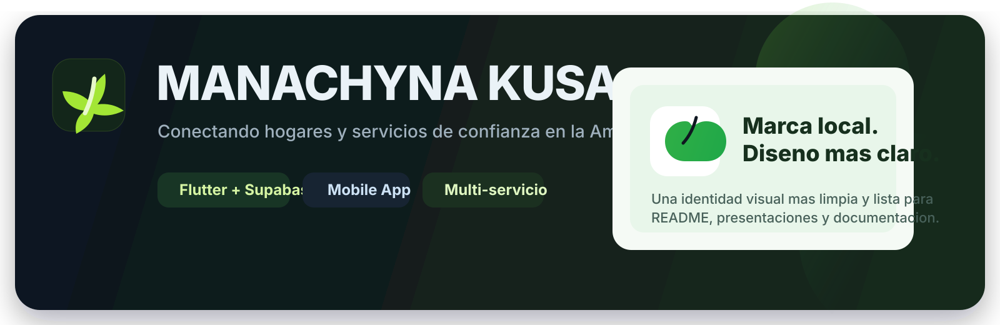
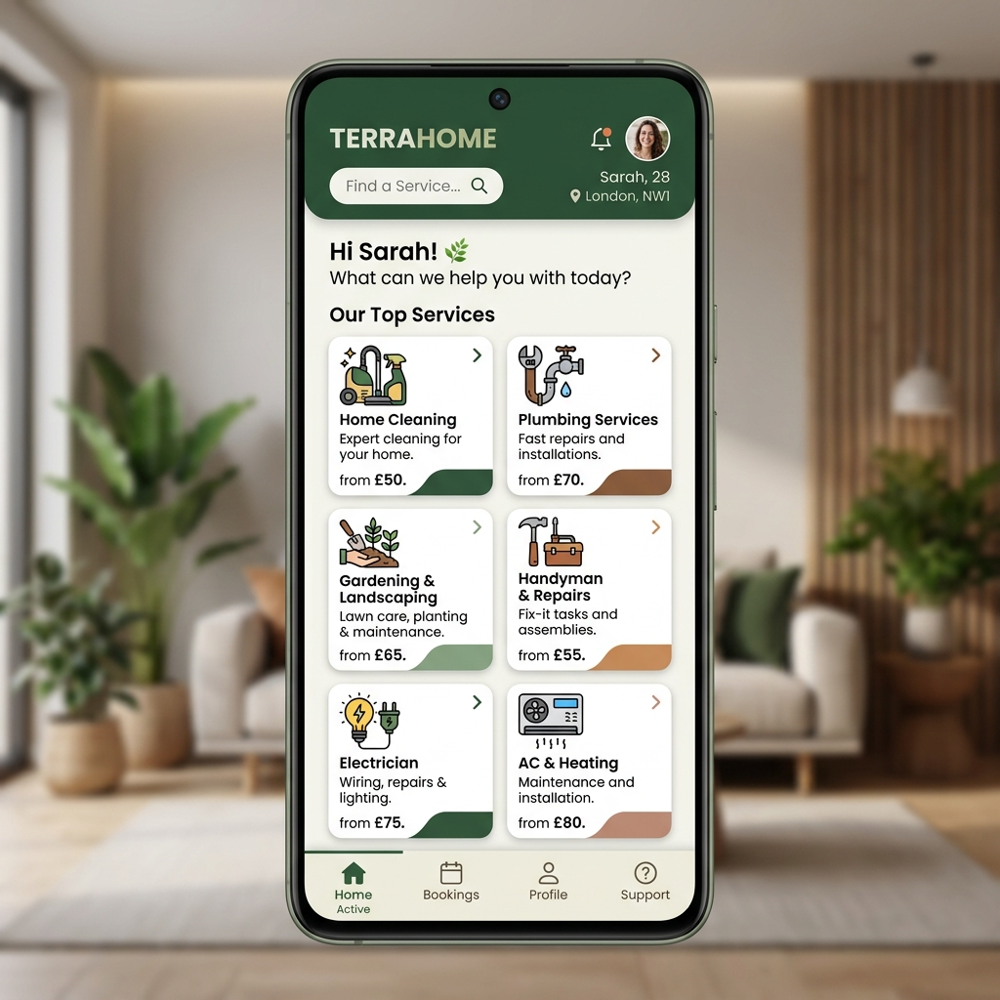

# 🌿 MANACHYNA KUSA

<div align="center">



<h3>Conectando hogares y servicios de confianza en la provincia de Napo, Ecuador.</h3>

[](https://flutter.dev)
[](https://dart.dev)
[](https://firebase.google.com)
[](https://supabase.com)

</div>

---

> **MANACHYNA KUSA** es más que una app — es un puente tecnológico desarrollado con el corazón de la Amazonía ecuatoriana.
> Diseñada para fomentar la economía local, facilita el contacto directo entre hogares y proveedores calificados de servicios domésticos en la provincia de Napo.

<div align="center">
  
</div>

---

## ✨ Lo que nos hace únicos

| | Característica | Descripción |
|---|---|---|
| 🔐 | **Seguridad Garantizada** | Ingreso rápido y seguro con Firebase Auth. |
| 🗺️ | **Magia Geográfica** | Integración con Google Maps para ubicar al experto más cercano en tiempo real. |
| ⭐ | **Comunidad de Confianza** | Reseñas 100% reales. Tú eliges a los mejores calificados. |
| 🎨 | **Identidad Amazónica** | UI moderna, limpia y profundamente inspirada en los colores de nuestra región. |
| 📱 | **Catálogo Vivo** | Lista dinámica y en crecimiento de servicios para tu hogar. |

---

## 🛠️ Servicios al Alcance de tu Mano

| Categoría | ¿Qué incluye? |
| :--- | :--- |
| 🧹 **Limpieza doméstica** | Mantenimiento y aseo integral de hogares, oficinas y espacios privados. |
| 🚰 **Plomería** | Soluciones rápidas para tuberías, filtraciones y sistemas de agua. |
| 🪚 **Carpintería** | Creación, reparación y restauración de muebles y estructuras de madera. |
| ⚡ **Electricidad** | Mantenimiento y soluciones seguras para sistemas eléctricos residenciales. |
| 🌿 **Mantenimiento verde** | Adecentamiento de maleza, jardinería y cuidado de áreas verdes. |
| 📦 **Menaje de casa** | Asistencia profesional en mudanzas, embalaje y organización. |
| ♻️ **Gestión de residuos** | Eliminación y recolección de desechos respetando el medio ambiente. |

---

## 📚 Documentación Técnica

¿Eres desarrollador o quieres entender cómo funciona la aplicación por dentro?

👉 **[Documentación Técnica Completa → DOCUMENTATION.md](DOCUMENTATION.md)**

Incluye arquitectura del sistema, estructura de base de datos e inyección de dependencias.

---

## 🚀 Empezando (Para Desarrolladores)

### Requisitos previos

- [Flutter SDK](https://docs.flutter.dev/get-started/install) `>= 3.7.0`
- [Dart SDK](https://dart.dev/get-dart) `>= 2.19.0`
- Cuenta activa en Firebase y Supabase
- Acceso al repositorio de GitHub con permisos del autor

### 1️⃣ Clonar el proyecto

```bash
git clone https://github.com/BETACRD01/Proyecto_final_2025.git
cd Proyecto_final_2025
```

### 2️⃣ Instalar dependencias

```bash
flutter pub get
```

### 3️⃣ Configurar el entorno

Debes obtener o configurar tus propias credenciales de backend:

| Archivo | Plataforma | Descripción |
|---|---|---|
| `google-services.json` | Android | Credenciales de Firebase para Android |
| `GoogleService-Info.plist` | iOS | Credenciales de Firebase para iOS |
| `lib/core/config/supabase_config.dart` | All | Variables de entorno de Supabase |

> ⚠️ **Importante:** Ninguna credencial está incluida en el repositorio. Contáctate con el autor para obtener acceso autorizado.

### 4️⃣ Ejecutar la aplicación

```bash
flutter run
```

---

## ✒️ Autor

<div align="center">

**Willian Cerda**
*Desarrollador Principal · Ingeniero de Software*

[](mailto:williancerda0@gmail.com)

</div>

---

## 📄 Licencia y Derechos de Autor

**Copyright © 2026 Willian Cerda. Todos los derechos reservados.**

Este proyecto es de **código cerrado y propietario**. No es Open Source ni de distribución libre.

El código fuente puede ser consultado con fines educativos o de referencia, pero **queda estrictamente prohibido** su uso comercial, copia, distribución, modificación o integración en otros productos sin el consentimiento previo, expreso y por escrito del autor.

> En resumen: puedes aprender de él, pero no puedes lucrar con él.

Para consultas sobre licencias, colaboraciones o permisos de uso, contactar directamente al autor.

---

<div align="center">
  <i>Desarrollado con ❤️ y mucho café para la comunidad de Napo, Ecuador 🌿</i>
</div>
